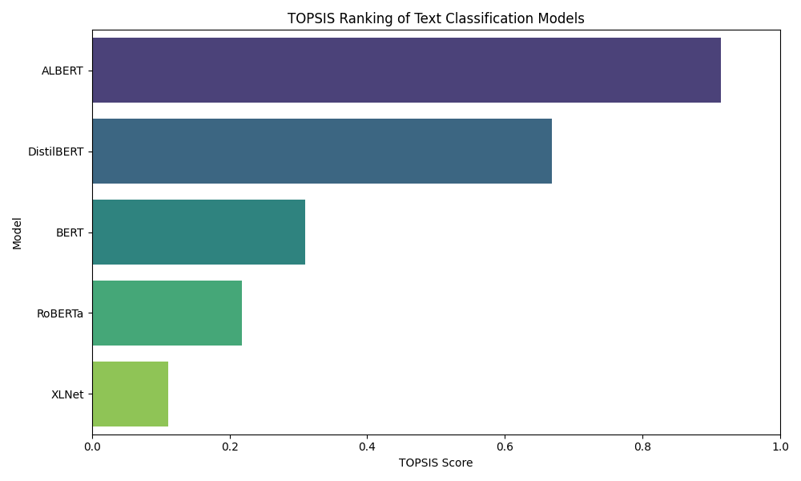
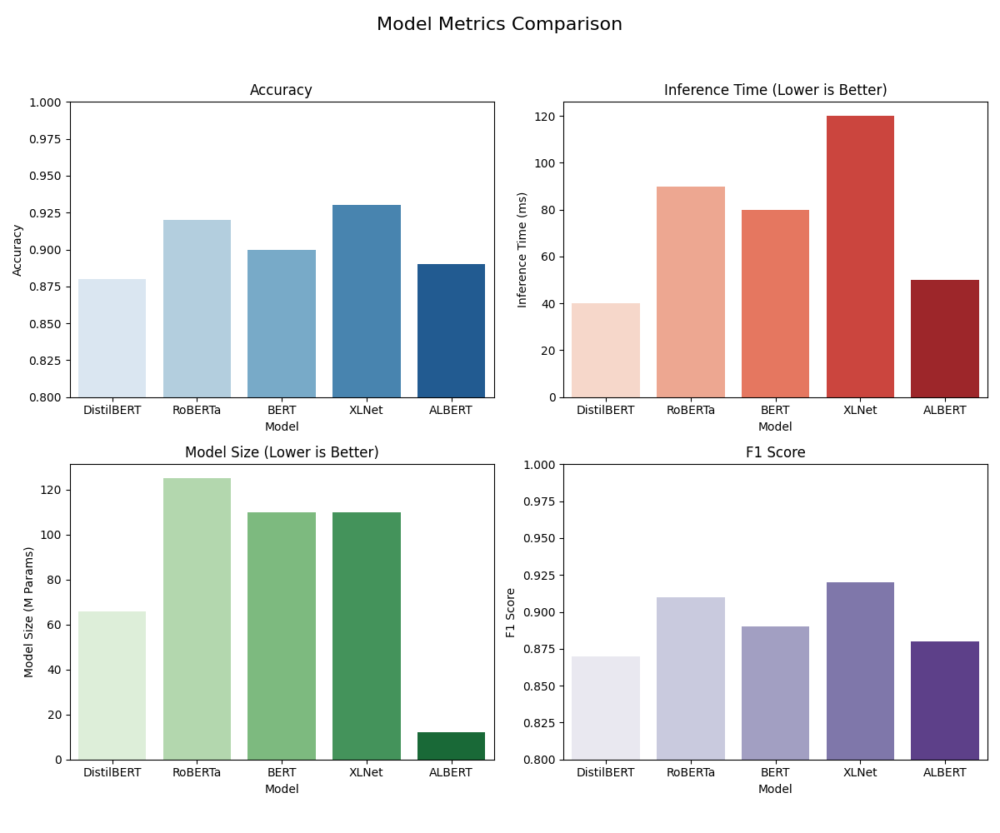

# TOPSIS for Text Classification Model Selection

## Assignment Details
- **Name**: Harsh Tanwar
- **Roll Number**: 102303812
- **Task**: Text Classification Model Selection using TOPSIS

## Overview

This project implements the **TOPSIS (Technique for Order of Preference by Similarity to Ideal Solution)** multi-criteria decision-making method to systematically evaluate and rank pre-trained transformer models for text classification tasks. TOPSIS is a powerful decision analysis technique that identifies the best alternative by measuring the geometric distance from the ideal solution.

## What is TOPSIS?

TOPSIS is a multi-criteria decision analysis method that ranks alternatives based on their similarity to an ideal solution. The fundamental principle is that the chosen alternative should have:
- **Shortest distance** from the **Positive Ideal Solution (PIS)**
- **Longest distance** from the **Negative Ideal Solution (NIS)**

### Mathematical Formulation

The TOPSIS algorithm follows these steps:

**Step 1: Normalization**

The decision matrix is normalized using vector normalization:

$$r_{ij} = \frac{x_{ij}}{\sqrt{\sum_{i=1}^{m} x_{ij}^2}}$$

where $r_{ij}$ is the normalized value, $x_{ij}$ is the original value, and $m$ is the number of alternatives.

**Step 2: Weighted Normalized Decision Matrix**

$$v_{ij} = w_j \times r_{ij}$$

where $w_j$ is the weight of criterion $j$, and $\sum_{j=1}^{n} w_j = 1$.

**Step 3: Ideal Solutions**

- **Positive Ideal Solution (PIS)**: $A^+ = \{v_1^+, v_2^+, ..., v_n^+\}$
  - For beneficial criteria: $v_j^+ = \max_i(v_{ij})$
  - For non-beneficial criteria: $v_j^+ = \min_i(v_{ij})$

- **Negative Ideal Solution (NIS)**: $A^- = \{v_1^-, v_2^-, ..., v_n^-\}$
  - For beneficial criteria: $v_j^- = \min_i(v_{ij})$
  - For non-beneficial criteria: $v_j^- = \max_i(v_{ij})$

**Step 4: Separation Measures**

Distance from PIS:
$$S_i^+ = \sqrt{\sum_{j=1}^{n} (v_{ij} - v_j^+)^2}$$

Distance from NIS:
$$S_i^- = \sqrt{\sum_{j=1}^{n} (v_{ij} - v_j^-)^2}$$

**Step 5: TOPSIS Score**

$$C_i = \frac{S_i^-}{S_i^+ + S_i^-}$$

where $0 \leq C_i \leq 1$. Higher $C_i$ indicates better performance.

## Models Evaluated

This analysis compares five state-of-the-art transformer-based models:

1. **DistilBERT** (`distilbert-base-uncased`)
   - A distilled version of BERT, 40% smaller and 60% faster
   - Retains 97% of BERT's language understanding

2. **RoBERTa** (`roberta-base`)
   - Robustly Optimized BERT Pretraining Approach
   - Trained with dynamic masking and larger batches

3. **BERT** (`bert-base-uncased`)
   - Bidirectional Encoder Representations from Transformers
   - The foundational model for many NLP tasks

4. **XLNet** (`xlnet-base-cased`)
   - Generalized autoregressive pretraining
   - Captures bidirectional context using permutation language modeling

5. **ALBERT** (`albert-base-v2`)
   - A Lite BERT with parameter sharing
   - Significantly smaller with competitive performance

## Evaluation Criteria

| Criterion | Description | Impact | Weight |
|-----------|-------------|--------|--------|
| **Accuracy** | Classification performance on test set | Higher is Better (+) | 1.0 |
| **Inference Time (ms)** | Average prediction latency | Lower is Better (-) | 1.0 |
| **Model Size (M Params)** | Number of trainable parameters | Lower is Better (-) | 1.0 |
| **F1 Score** | Harmonic mean of precision and recall | Higher is Better (+) | 1.0 |

### Why These Metrics?

- **Accuracy & F1 Score**: Measure model effectiveness in classification
- **Inference Time**: Critical for real-time applications and user experience
- **Model Size**: Impacts deployment costs, memory requirements, and environmental footprint

## Results & Analysis

### TOPSIS Rankings

| Rank | Model | TOPSIS Score | Key Strengths |
|------|-------|--------------|---------------|
| 1 | **ALBERT** | 0.9144 | Smallest size (12M params), fast inference (50ms), good accuracy |
| 2 | **DistilBERT** | 0.6685 | Balanced performance, efficient (66M params, 40ms) |
| 3 | **BERT** | 0.3103 | Strong baseline, moderate size (110M params) |
| 4 | **RoBERTa** | 0.2174 | Highest accuracy (0.92) but large and slow |
| 5 | **XLNet** | 0.1103 | Best F1 (0.92) but slowest inference (120ms) |

### Key Insights

**Winner: ALBERT**
- Achieves the best TOPSIS score (0.9144) due to its exceptional efficiency
- Despite having the smallest size (12M parameters), it maintains competitive accuracy (0.89)
- Fastest inference time (50ms) makes it ideal for production deployment
- Excellent trade-off between performance and resource requirements

**Efficiency vs. Performance Trade-off**
- RoBERTa and XLNet achieve the highest accuracy/F1 scores but are penalized for large size and slow inference
- DistilBERT offers a strong middle ground with 88% accuracy and fast inference
- For resource-constrained environments, ALBERT and DistilBERT are superior choices

## Visualizations

### TOPSIS Rankings

*Bar chart showing TOPSIS scores for each model. Higher scores indicate better overall performance across all criteria.*

### Detailed Metrics Comparison

*Comprehensive comparison of all four evaluation metrics across the five models.*

## How to Run

### Prerequisites
```bash
pip install pandas numpy matplotlib seaborn topsis
```

### Execution
```bash
python main.py
```

### Output Files
- `topsis_results.csv`: Detailed rankings with scores
- `rankings_graph.png`: TOPSIS score visualization
- `metrics_comparison.png`: Multi-metric comparison charts

## Project Structure

```
.
├── main.py                    # Main execution script
├── topsis.py                  # TOPSIS implementation class
├── README.md                  # This file
├── topsis_results.csv         # Generated results
├── rankings_graph.png         # TOPSIS rankings visualization
└── metrics_comparison.png     # Metrics comparison charts
```

## Implementation Details

The `Topsis` class in `topsis.py` implements the complete TOPSIS algorithm:

1. **Normalization**: Vector normalization of the decision matrix
2. **Weighting**: Application of criterion weights
3. **Ideal Solutions**: Calculation of PIS and NIS based on impact directions
4. **Separation Measures**: Euclidean distance calculations
5. **Score Computation**: Final TOPSIS score calculation

## Link
https://colab.research.google.com/drive/1yyoK3Z5_e0zVp1yGOoNlZEOhMgWTb_HU?usp=sharing

## License

This project is created for academic purposes as part of a Predictive Analysis course assignment.

---

**Author**: Harsh Tanwar (102303812)
